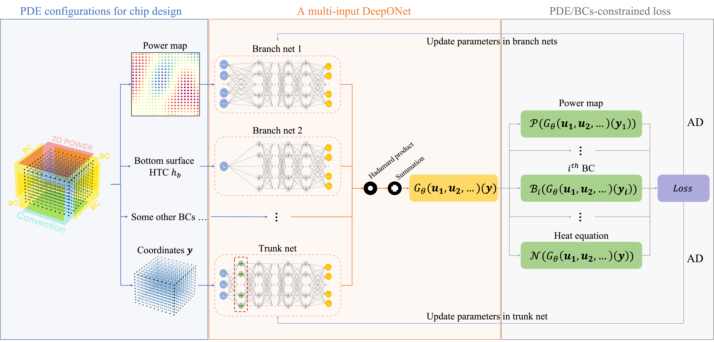

# DeepOHeat (DAC 2023)

DeepOHeat: Operator Learning-based Ultra-fast Thermal Simulation in 3D-IC Design [[Paper]](https://arxiv.org/pdf/2302.12949)

Thermal-aware floorplanning is particularly important in designing 3D integrated circuits. To reduce turnaround time in design optimization loops and avoid collecting data in substantial costs, we propose DeepOHeat with the following features:

- For the first time, DeepOHeat solves a family of heat equations under various 3D-IC configurations in an end-to-end, data-free scheme.
- We encode 3D-IC configurations using a modular approach: stacked cuboidal geometry, boundary conditions, 2d/3d power maps and full chip material conductivity.
- We achieve satisfactory accuracy when benchmarking DeepOHeat against [Cadence Celsius Thermal Solver](https://www.cadence.com/en_US/home/tools/system-analysis/thermal-solutions/celsius-thermal-solver.html).

<br>
<p align="center">

<br><br>
<b>Figure 1.</b> DeepOHeat framework.
</p>

## Getting Started
To reproduce examples in our paper or directly use pretrained checkpoints, please refer to [2d_power_map](./DeepOHeat/2d_power_map) and [multi_htc_bc](./DeepOHeat/multi_htc_bc).

- In particular, [prototype.py](./DeepOHeat/2d_power_map/prototype.py) directly runs inference on the 10 test cases we showcased in the paper, at Section V.A.
- Side by side comparison against [Cadence Celsius](https://www.cadence.com/en_US/home/tools/system-analysis/thermal-solutions/celsius-thermal-solver.html) is in the benchmark folder of each experiment's logging directory, if provided.

The [single_case_pinns](./single_case_pinns) directory contains examples solving single instances of various 3D-IC configurations.

- [complex_geometry](./single_case_pinns/complex_geometry) showcases a geometry of two stacked cuboids with a volumetric power defined in the middle of the bottom cuboid.
- [quarter_power](./single_case_pinns/quarter_power) and [uniform_power](./single_case_pinns/uniform_power) showcase 2d surface power on top with different sizes.
- [volumetric_power](./single_case_pinns/volumetric_power) showcases a single cuboidal geometry with a volumetric power.


## Showcase

<p align="center">

<br><br>
<b>Figure 2.</b> Benchmark DeepOHeat against Cadence Celsius. Top -> bottom: Celsius, DeepOHeat, point-wise error.
</p>

## Citation
If you find this repo useful, please cite our paper.

```
@inproceedings{liu2023deepoheat,
  title={DeepOHeat: operator learning-based ultra-fast thermal simulation in 3D-IC design},
  author={Liu, Ziyue and Li, Yixing and Hu, Jing and Yu, Xinling and Shiau, Shinyu and Ai, Xin and Zeng, Zhiyu and Zhang, Zheng},
  booktitle={2023 60th ACM/IEEE Design Automation Conference (DAC)},
  pages={1--6},
  year={2023},
  organization={IEEE}
}
```

## License
DeepOHeat is provided under MIT License, please see [LICENSE](./LICENSE) for full license text.

## Contact
If you have any question regarding the code or the paper, please contact [ziyueliu@ucsb.edu](mailto:ziyueliu@ucsb.edu).

## Acknowledgement
This is a joint work between [Zhang's group at UCSB](https://web.ece.ucsb.edu/~zhengzhang/) and Celsius R&D team at [Cadence Design Systems](https://www.cadence.com/en_US/home.html).
